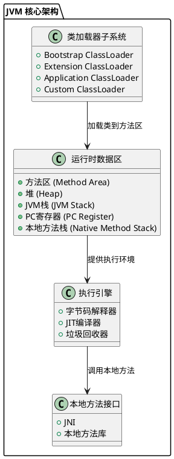
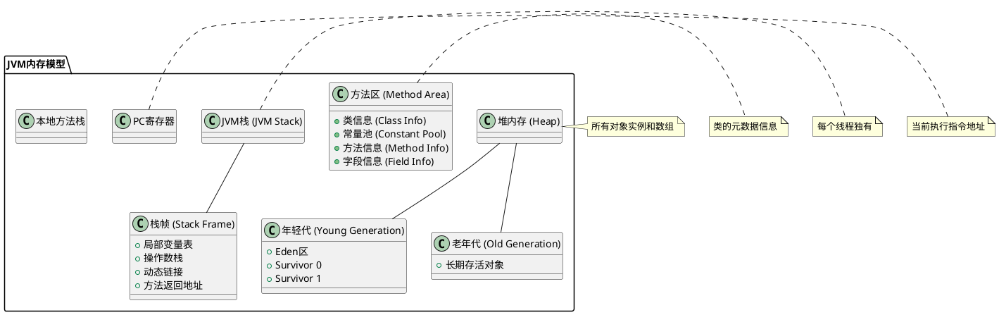
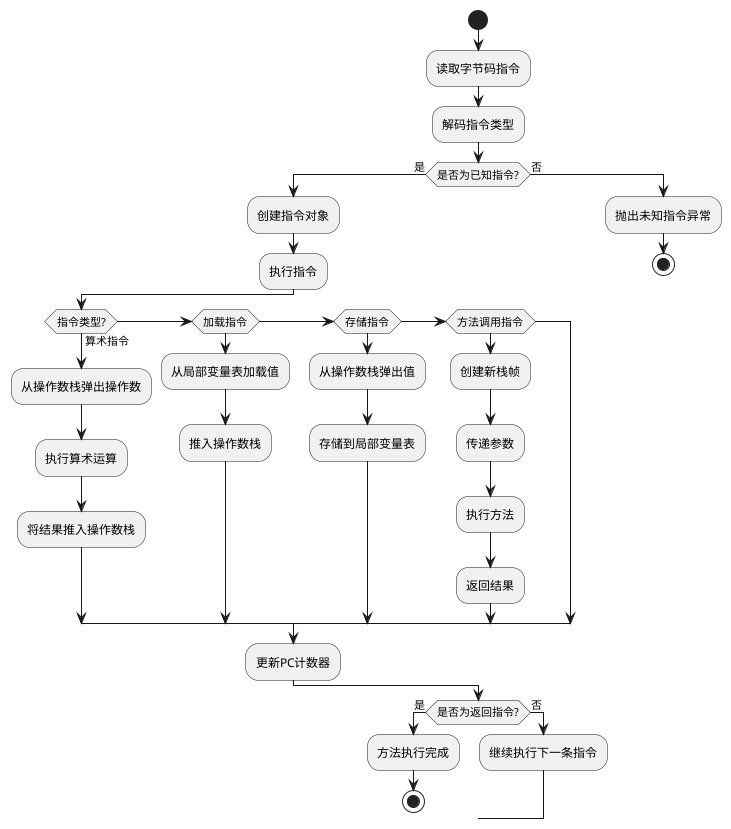
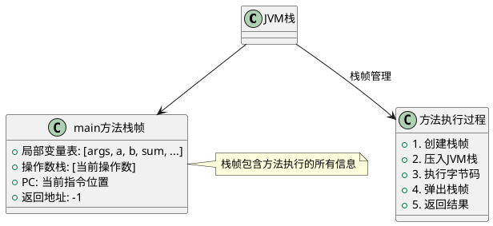
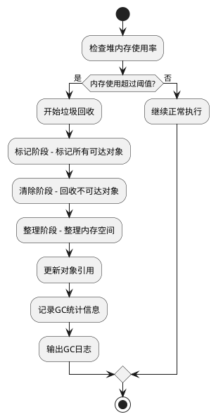

# JVM原理深度解析：通过可视化GVM实现彻底理解Java虚拟机

JVM作为Java生态的核心，其内部机制对很多开发者来说都是"黑盒"。今天我们通过一个完全可视化的GVM（Generic Virtual Machine）项目，让JVM的工作过程变得"看得见、摸得着"，帮助大家彻底理解和记忆JVM原理。

## 为什么要自己实现一个JVM？

在学习JVM原理的过程中，我发现很多同学都会遇到这样的问题：

理论知识太抽象，看书看文档总是云里雾里；无法直观看到JVM内部的工作过程，只能靠想象；概念容易忘记，缺乏实践印象，过几天就忘了；不知道各个组件是如何协作的，总觉得知识点很零散。

**GVM项目的核心价值**在于：通过完整实现一个简化版JVM，让每个字节码指令的执行、每个内存区域的变化都变得可见和可理解。

## JVM整体架构：从宏观到微观

### JVM核心架构图



## 深入理解：JVM内存模型

### JVM内存布局详解



## 核心亮点：GVM的可视化特性

### 详细的执行日志

GVM最大的特色就是完全透明的执行过程。我们来看看一个简单的算术运算在GVM中是如何执行的：

```java
// 源代码
int a = 10;
int b = 5;
int sum = a + b;
```

**GVM执行日志**：
```
[GVM] [BYTECODE] PC=  8: bipush 10
[GVM] [STACK] 操作数栈: 0/3 个元素
[GVM] [TRACE] 下一个PC: 10

[GVM] [BYTECODE] PC= 10: istore_1  
[GVM] [STACK] 操作数栈: 1/3 个元素
[GVM] [TRACE] 局部变量: [slot1=Slot[type=int, value=10]]

[GVM] [BYTECODE] PC= 15: iadd
[GVM] [STACK] 操作数栈: 2/3 个元素  
[GVM] [TRACE] 执行加法：10 + 5 = 15
```

### 实时内存状态展示

**局部变量表状态**：
```
LocalVariableTable[maxLocals=13]:
  [0] Slot[type=empty, value=null]
  [1] Slot[type=int, value=10]      // 变量a
  [2] Slot[type=int, value=5]       // 变量b  
  [3] Slot[type=int, value=15]      // 变量sum
```

**操作数栈状态**：
```
OperandStack[maxStack=3, size=2]:
  -> Element[type=int, value=10]    // 栈顶
     Element[type=int, value=5]     // 栈底
```

## 字节码执行流程：从指令到结果

### 字节码执行流程图



## 方法调用机制：栈帧的生命周期

### 方法调用栈帧管理



## 对象创建与内存管理

### 对象创建流程

我们来看看GVM中对象是如何创建的：

```java
SimpleArithmetic obj = new SimpleArithmetic();
```

**GVM执行过程**：
```
[GVM] [BYTECODE] PC= 72: new #9
[GVM] [TRACE] new: 创建对象 SimpleArithmetic@381259350_class9

[GVM] [BYTECODE] PC= 75: dup  
[GVM] [TRACE] dup: 复制栈顶元素

[GVM] [BYTECODE] PC= 76: invokespecial #10
[GVM] [TRACE] invokespecial: 调用SimpleArithmetic构造函数

[GVM] [BYTECODE] PC= 79: astore 10
[GVM] [TRACE] astore: 将引用存储到局部变量表[10]
```

### 堆内存管理

**堆内存详情**：
```
=== 堆内存详情 ===
最大大小: 256 MB (268435456 bytes)
当前使用: 64 bytes (0.00%)
对象总数: 1
年轻代: 1 个对象
老年代: 0 个对象

--- 堆中的对象 ---
对象ID=1, 类=SimpleArithmetic, 状态=ALIVE, 大小=64 bytes
```

## 垃圾回收机制

### GC执行流程



**GC日志示例**：
```
[GVM] [GC] 开始垃圾回收 - 当前堆使用: 180MB/256MB
[GVM] [GC] 标记阶段完成 - 找到 1250 个存活对象
[GVM] [GC] 清除阶段完成 - 回收了 45MB 内存  
[GVM] [GC] GC完成 - 用时: 12ms, 回收后堆使用: 135MB/256MB
```

## 学习价值与实践意义

### 深度理解JVM原理

通过GVM项目，大家可以：

- **可视化学习**：每个指令执行都有详细日志
- **加深记忆**：通过实践加深对概念的理解  
- **掌握细节**：了解JVM内部协作机制
- **触类旁通**：理解其他虚拟机的设计思路

### 项目核心特性

**完整的JVM功能实现**：
- 类加载器系统（支持双亲委派模型）
- 运行时数据区（堆、栈、方法区等）
- 字节码执行引擎（支持62种指令）
- 内存管理和垃圾回收
- 异常处理机制
- 方法调用机制

**详细的日志系统**：
```java
Logger.setLevel(Logger.Level.TRACE);  // 设置最详细日志级别

// 不同类型的日志
Logger.classload("正在加载类: %s", className);
Logger.memory("分配对象: ID=%d, 大小=%d bytes", id, size);  
Logger.bytecode("PC=%d: %s", pc, instruction);
Logger.stack("操作数栈: %d/%d 个元素", current, max);
```

## 实际运行效果

我们来看看一个完整的程序在GVM中的执行效果：

### SimpleArithmetic程序执行

```java
public class SimpleArithmetic {
    public static int staticCounter = 0;
    private int instanceValue = 42;
    
    public static void main(String[] args) {
        int a = 10, b = 5;
        int sum = a + b;                    // 基本运算
        int result1 = add(a, b);            // 静态方法调用
        int result2 = multiply(a, b);       // 静态方法调用
        staticCounter++;                    // 静态字段操作
        
        SimpleArithmetic obj = new SimpleArithmetic();  // 对象创建
        int instanceVal = obj.getInstanceValue();       // 实例方法调用
        
        int finalResult = sum + result1 + result2 + staticCounter + instanceVal;
        System.out.println("计算完成，最终结果: " + finalResult);
    }
    
    public static int add(int x, int y) { return x + y; }
    public static int multiply(int x, int y) { return x * y; }
    public int getInstanceValue() { return this.instanceValue; }
}
```

**执行结果**：
```
[GVM] ========================= GVM 开始执行 =========================
[GVM] 主类: SimpleArithmetic
[GVM] 参数: []

=== 类信息（方法区内容）===
类名: SimpleArithmetic
父类: java/lang/Object
字段信息: staticCounter (I), instanceValue (I)  
方法信息: main, add, multiply, getInstanceValue...

[GVM] System.out.println: 计算完成，最终结果: 427
[GVM] ========================= GVM 执行完成 =========================
执行统计: methods=1, instructions=78, errors=0, time=110ms
```

## 如何使用GVM学习JVM

### 环境准备

```bash
# 克隆项目
git clone https://github.com/your-repo/gvm.git
cd gvm

# 编译项目  
mvn compile

# 编译示例程序
javac -d examples examples/SimpleArithmetic.java
```

### 运行和观察

```bash
# 运行GVM（调试模式）
java -cp target/classes:examples io.github.javpower.gvm.GVM \
  -debug -cp examples SimpleArithmetic
```

### 学习建议

**循序渐进的学习路径**：

1. **基础概念理解** - 先了解JVM整体架构
2. **运行简单程序** - 观察基本指令执行
3. **分析内存变化** - 理解堆栈变化过程  
4. **深入方法调用** - 掌握栈帧管理机制
5. **研究对象生命周期** - 理解GC工作原理
6. **扩展功能实现** - 添加新的字节码指令


**结语**：JVM不再是黑盒！通过GVM项目，我们将抽象的概念变成了可见的执行过程。每一条字节码指令的执行、每一次内存的分配、每一个对象的创建都清晰可见。这就是最好的JVM学习方式——看得见的虚拟机！

立即动手实践GVM项目，让JVM原理不再是纸上谈兵，而是真正掌握的核心技能！

---

**相关资源**：
- 项目地址：[GitHub - GVM项目](https://github.com/javpower/gvm)
- 详细文档：完整的README和代码注释
- 示例程序：多个测试用例帮助理解

关注我们，获取更多技术深度解析！ 